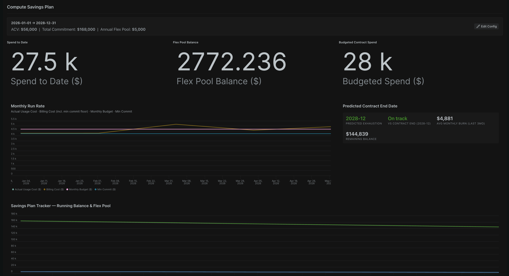
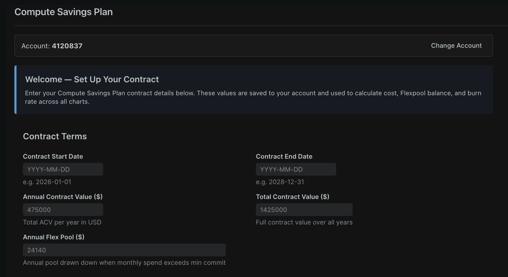
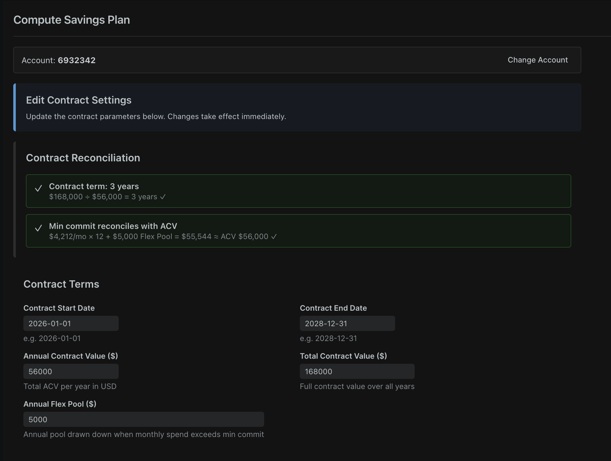
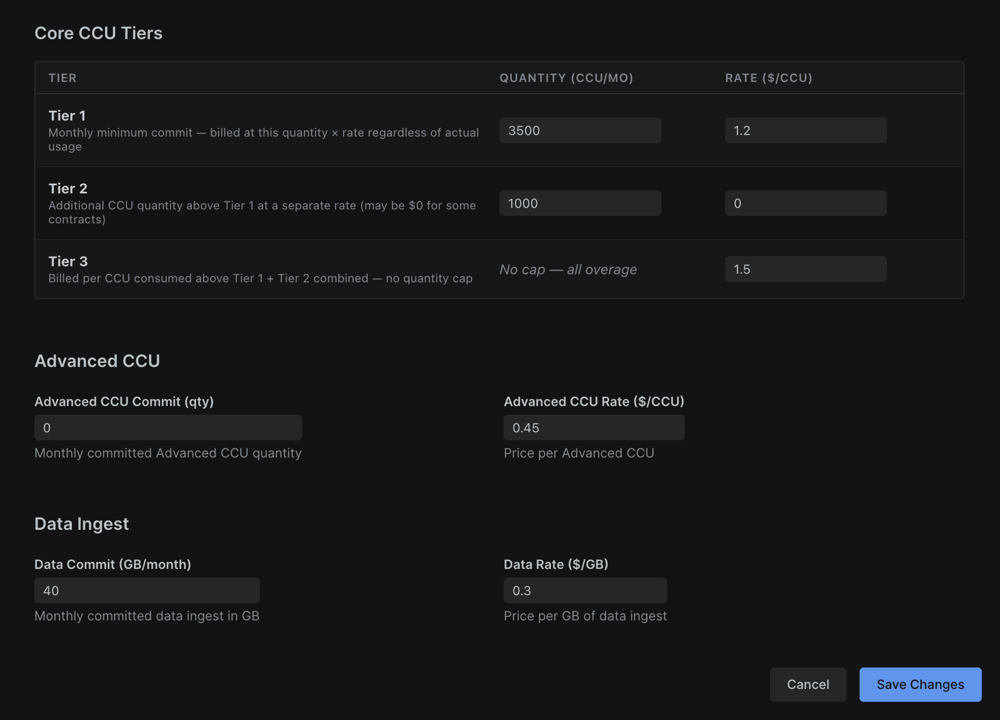

# New Relic Compute Savings Plan Nerdlet

A New Relic custom application (Nerdlet) for customers on the **Compute Savings Plan** (CCU-based) licensing model. Visualises contract drawdown, monthly spend vs budget, Flexpool balance over time, and predicts when the contract will be exhausted based on current burn rate.

### Dashboard



### Contract Setup & Edit

| First-run setup | Edit config with reconciliation checks |
|---|---|
|  |  |

### CCU Tier Configuration



---

## Features

- **Contract KPIs** — Spend to Date, Flex Pool Balance, and Budgeted Contract Spend at a glance
- **Monthly Run Rate chart** — Actual usage cost, billing cost (with min-commit floor), monthly budget, and min-commit reference line — all on one chart
- **Savings Plan Tracker** — Running balance chart showing on-track vs actual remaining contract value, plus Flexpool balance over the contract term
- **Predicted Contract End Date** — Calculates average monthly burn rate (last 3 months) and projects when the contract balance will be exhausted, with colour-coded status (green = on track, blue = burning slow, amber = slightly fast, red = significantly over)
- **Monthly Spend Breakdown table** — Per-month breakdown of Core CCU, Advanced CCU, and Data Ingest quantities and costs
- **First-run setup UI** — A guided form to enter contract parameters, saved to NerdStorage per account (no hardcoded values)
- **Live contract reconciliation** — Real-time validation checks that TCV is an even multiple of ACV and that min commit + Flexpool reconciles with ACV

---

## Prerequisites

- A New Relic account on the **Compute licensing model** with access to `NrConsumption` data
- [`nr1` CLI](https://developer.newrelic.com/build-apps/ab-test/install-nr1/) installed:
  ```bash
  npm install -g @datanerd/nr1
  ```
- **Node.js 16** recommended — nr1 v2.x has known OpenSSL compatibility issues with Node 17+:
  ```bash
  nvm install 16 && nvm use 16
  ```
- A New Relic **User API key** with NerdStorage read/write access

---

## Deploy

### 1. Clone and install

```bash
git clone https://github.com/<your-org>/nr-compute-savings-plan.git
cd nr-compute-savings-plan
npm install
```

### 2. Generate your own UUID — do not skip this step

The UUID in this repo belongs to the original author's account. You must generate a new one before publishing:

```bash
nr1 nerdpack:uuid --generate --force
```

### 3. Add your New Relic profile

```bash
nr1 profiles:add -n <profile-name> -k <YOUR_USER_API_KEY> -r us
nr1 profiles:default -n <profile-name>
```

> Replace `us` with `eu` if your account is on the EU data centre.

### 4. Test locally

```bash
nr1 nerdpack:serve
```

Open [https://one.newrelic.com/?nerdpacks=local](https://one.newrelic.com/?nerdpacks=local) and find **Compute Savings Plan** in the launcher.

### 5. Publish and subscribe

```bash
nr1 nerdpack:publish
nr1 nerdpack:deploy --channel=STABLE
nr1 subscription:set --channel=STABLE
```

The nerdlet will now appear in your New Relic account under **Apps** for all users subscribed to the account.

---

## Configuration (first run)

When you open the nerdlet for the first time, you will be prompted to enter your contract details. These are saved to NerdStorage scoped to your account — no data leaves New Relic.

| Field | Description |
|---|---|
| Contract Start Date | Start of the Compute Savings Plan term (`YYYY-MM-DD`) |
| Contract End Date | End of the term (`YYYY-MM-DD`) |
| Annual Contract Value ($) | ACV — total value per year |
| Total Contract Value ($) | TCV — full value across all years (should be ACV × term years) |
| Annual Flex Pool ($) | Pool of funds that rolls over and is drawn down when monthly spend exceeds the minimum commit |
| Tier 1 CCU Qty | Monthly committed Core CCU quantity at Tier 1 rate |
| Tier 1 CCU Rate ($/CCU) | Price per CCU in the Tier 1 band |
| Tier 2 CCU Qty | Additional CCU quantity in the Tier 2 band |
| Tier 2 CCU Rate ($/CCU) | Price per CCU in the Tier 2 band (0 if free) |
| Tier 3 CCU Rate ($/CCU) | Overage rate — applied to all Core CCU above Tier 1 + Tier 2 |
| Advanced CCU Commit (qty) | Monthly committed Advanced CCU quantity |
| Advanced CCU Rate ($/CCU) | Price per Advanced CCU |
| Data Commit (GB/month) | Monthly committed data ingest in GB |
| Data Rate ($/GB) | Price per GB of data ingest |

Settings can be updated at any time via the **Edit Config** button on the dashboard.

---

## How it works

- **Data source** — All charts query the `NrConsumption` event type in your New Relic account, which contains monthly CCU consumption and data ingest records.
- **Cost calculation** — Monthly billing cost is computed using the tiered CCU pricing formula inline in NRQL: Tier 1 committed cost + Tier 2 band cost + Tier 3 overage + Advanced CCU + Data Ingest.
- **Config storage** — Contract parameters are saved to [NerdStorage](https://developer.newrelic.com/build-apps/set-up-dev-env/) (AccountStorage scope) so they persist across sessions without any external database.
- **Client-side charts** — The Savings Plan Tracker and Burn Rate Predictor compute running totals and projections in JavaScript (NRQL cannot natively do cumulative sums across time buckets).

---

## Important caveats

> ⚠️ All figures in this nerdlet are **estimates** based on `NrConsumption` data. The source of truth for billing is the AWS Marketplace or your New Relic billing portal.

---

## License

[MIT](LICENSE)
